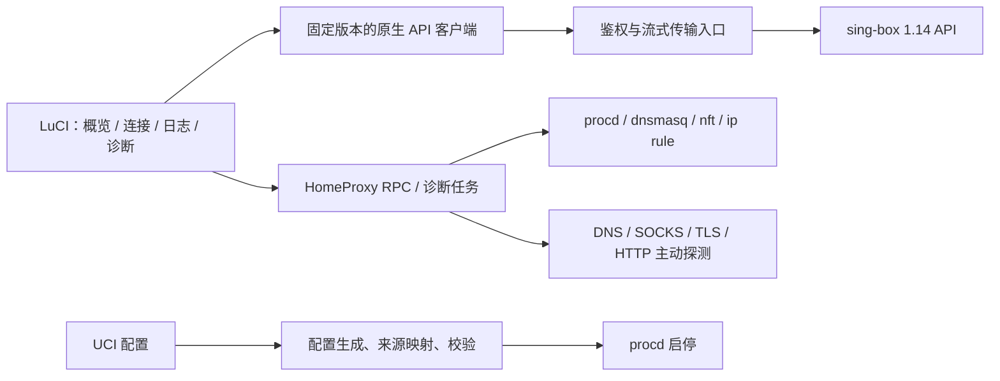

# sing-box 1.12.25 → 1.14.0：HomeProxy 适配与观测设计

> 当前安装策略更新：采用全新配置安装；已移除新增的 1.14 迁移备份和旧订阅 ID 自动映射，主包与语言包分离。下文迁移/打包记录属于历史阶段，当前行为以 [开发与安装说明](development-and-installation.md) 为准。

核查日期：2026-09-08。HomeProxy 基线：`edece28a0085f36d469ec82c8d45f562f602db53`。

目标设备由用户确认：MT7986A，128 MB Flash，512 MiB RAM；ImmortalWrt 25.12.0 r37854-4b24da3b4c5c，内核 6.12.87，LuCI a701807e。可用 overlay 空间、其他常驻服务和典型连接规模尚未确认。

建议以官方 1.14.0 为明确目标，完整迁移 HomeProxy 已有功能，并以官方原生 API 作为运行状态数据来源。用户已明确选择同时支持两种入口：LuCI 内实现常用观测与专属链路诊断，同时提供官方 Dashboard 的安装、启用和访问入口。两者复用同一个核心 API 服务；官方 Dashboard 原样打包，HomeProxy 维护自己的 LuCI 展示和系统诊断。核心与 Dashboard 均控制配套版本。新协议与平台功能单列为扩展能力。

本文保留分析和实施设计，代码实现已在工作区进行。已对照两个正式 tag 的源码，使用官方 Linux amd64 二进制验证生成配置及 API；尚未完成设备上的透明代理、真实节点与性能回归。按用户要求，本地不编译、不构建安装包；仅运行现有工具进行语法检查和脚本测试，协议资源生成与配套包构建交给 CI。

## 1. 版本约束与验收范围

当前 `Makefile` 和 `.github/build-ipk.sh` 均只依赖 `sing-box` 包名。`singbox_get_features` 读取版本与 build tags，但没有配置 schema 兼容范围。启动时生成 JSON，再执行 `sing-box check`。CI 构建 LuCI 包，没有核心版本矩阵。

实施应同时固定 HomeProxy 提交、sing-box tag/hash、feed 提交、编译 tags、工具链、目标 OpenWrt 分支。1.14.0 的 `go.mod` 声明 Go 1.25.5；本次官方 amd64 发布二进制实际使用 Go 1.26.7，二者不是同一概念。核心全功能包和 tiny 包需要分别验收功能探测。

建议兼容性契约：新实现以固定 1.14.0 为首个支持基线；未来版本先验证再纳入支持。1.12.25 保留原有安装包、配置快照和对照结果用于回退，不在新生成器中长期维护两套语义。若后续确有同时支持两个核心的要求，再显式增加版本适配层。

来源：[1.14.0 go.mod](https://github.com/SagerNet/sing-box/blob/v1.14.0/go.mod)、[1.12.25 到 1.14.0 源码比较](https://github.com/SagerNet/sing-box/compare/v1.12.25...v1.14.0)。

## 2. 兼容性矩阵

“必须迁移”包含会阻止启动的配置和必须保持的行为；“语义回归”不能仅靠 `check` 判断；“新增能力”应明确是否纳入产品功能。

| 差异 | 当前 HomeProxy 接触面 | 1.14.0 结论 | 完整适配要求 |
|---|---|---|---|
| 入站 `sniff/sniff_override_destination` | `generate_client.uc` 的 mixed、redirect、tproxy、tun | 旧字段硬拒绝 | 改为 route actions；按 inbound 保持作用范围和规则顺序；审查旧目标覆盖语义，迁移 UI/UCI，不能仅重命名 |
| direct outbound 的 `override_address/override_port` | `generate_outbound()` 仍可输出 | 硬拒绝；1.12.25 已默认拒绝、仅有旧兼容开关 | 将覆盖行为放到合适的路由动作；节点复用、默认出站和 detour 场景逐一验证，避免把节点局部行为扩大到全部流量 |
| 旧 DNS `address/address_resolver` 格式 | 主生成器已使用新服务器格式 | 旧格式硬拒绝 | 保留已有 typed server 迁移；检查恢复备份、自定义配置和导入路径，不重复误迁已完成配置 |
| DNS 规则 `outbound` | 自定义 DNS 生成器有残留；已有 UCI 迁移逻辑 | 正常环境拒绝，仍存在显式旧兼容开关 | 清除生成出口，校正迁移完整性，使用 dial `domain_resolver`；不以旧环境开关作为发布方案 |
| DNS `query_type/ip_version` 与旧 `strategy`、地址过滤混用 | 绕过大陆、代理域名列表和自定义 DNS 均可触发 | 同一 DNS 配置中不兼容，启动拒绝 | 一并迁移为查询类型规则、`evaluate`、响应匹配和 `respond`；保留优先级、回退和拒绝行为 |
| DNS 查询类型用于内部解析 | 未指定服务器的 resolve 等路径 | 以前忽略部分查询类型条件，现参与匹配 | 检验节点 bootstrap、WireGuard 目标解析、A/AAAA 和规则默认值，防循环与意外拒绝 |
| `independent_cache` | DNS 设置页、客户端生成器 | 缓存始终按 transport 区分，旧选项弃用 | 删除无效开关并解释旧设置的归宿，覆盖缓存隔离场景 |
| `store_rdrc/rdrc_timeout` | 自定义 DNS、cache 文件 | 旧缓存机制进入弃用阶段 | 评估迁移到 `store_dns`，不要把“拒绝结果缓存”与“完整 DNS 缓存”当成完全等价；说明保留范围和有效期 |
| 乐观缓存与 DNS timeout | 现 UI 尚无对应完整设置 | 新增 `optimistic`、全局/每次解析 timeout | 增加有需要的高级项；诊断区分过期缓存响应、后台刷新失败和首次查询失败 |
| `download_detour`、隐式默认 HTTP client | 自动与自定义远程 rule-set | 1.14 弃用，计划 1.16 移除 | 建立 `http_clients`，明确每个规则集下载路径；新旧字段不同时输出；检验冷启动、离线缓存与更新失败 |
| rule-set 组合语义 | 自定义路由/DNS、多个远程规则集 | 只有单条 default 且无 invert 的集合继续按合并语义处理，其他集合独立匹配 | 用固定规则集样本对比命中集合；覆盖复合 AND/OR、invert、多规则集合；固定远程内容指纹 |
| TUN DNS 接管 | 当前由 dnsmasq、ip rule、nftables 主导，`auto_route:false` | 新增 `dns_mode/dns_address`，默认 DNS 接管行为改变 | 明确 DNS 管理归属；保留现架构时评估显式 `dns_mode:disabled`；不同 OpenWrt 环境实测，不直接打开 auto_route/auto_redirect |
| UDP NAT | TUN 旧 `endpoint_independent_nat`，TProxy、WireGuard | 新增 mapping/filtering/max；旧布尔字段仍可解析，不代表还控制行为 | 从期望 NAT 语义迁移到新字段；覆盖游戏、STUN、UDP 超时及会话上限，不能盲目把 false 映射为某种新模式 |
| Hysteria2 默认 Chrome QUIC 模拟 | 节点/订阅/生成器尚无新控制项 | 默认改变握手；Ed25519 服务端证书会失败；部分 QUIC 参数被覆盖 | 增加 `disable_chrome_parrot` 能力和解释；迁移策略区分存量节点与新节点；测试 Ed25519/RSA/ECDSA；错误提示不能只说节点超时 |
| Hysteria2 新参数 | obfs、跳跃端口、带宽项 | 新增 gecko、BBR profile、随机跳跃区间、Realm | 与已有节点参数相关的 UI/导入/生成同步扩展；Realm 服务支持可独立安排 |
| WireGuard outbound → endpoint | 当前已生成 endpoint | 已迁移的基础不应重做 | 验证默认出站、URLTest、UDP、域名服务器、路由标记和新 NAT 默认值 |
| `block` outbound | 默认生成 `block-out` | 本次官方 1.14.0 `check` 通过，源码仍注册该类型 | 不能仅按泛化弃用表判定其必然失败；继续以实际 target tag 和二进制为依据 |
| TLS/ECH | 节点和服务端 TLS 表单、证书、Reality | 1.13 清除部分旧 ECH 字段；新增证书 pinning、mTLS、曲线、握手超时等 | 本生成器未输出已移除的两项 ECH 字段；检查存量备份，回归已有 TLS 参数；新增选项单列能力覆盖表 |
| 内联 ACME | `generate_server.uc` 输出 `tls.acme` | 1.14 弃用，计划 1.16 移除 | 迁移到 certificate provider；同步证书目录、ujail 挂载权限、DNS01 参数与持久化，不只迁移 JSON |
| local DNS 与 TCP keepalive | `system-dns`、所有拨号/监听 | local DNS 实现与 mDNS 行为扩展；keepalive 初始默认值变化 | 在实际 OpenWrt resolver 环境验证 .local、单标签名和 DNS 回环；记录默认值变化及长期连接影响 |
| ICMP、L3、bypass | 当前防火墙主要处理 TCP/UDP | 1.13 支持有限路径 ICMP；1.14 扩展 L3 转发与 bridge | 若开放该能力，UI、nft、策略路由和权限全部配套；不能承诺任意代理协议都能代理 ping |
| 新 API 服务 | 当前没有生成 `services: [{type:'api'}]` | 原生 gRPC/gRPC-Web，API version 可查询 | 客户端/服务端进程分开监听；生成客户端固定到 1.14.0 proto；支持重连、取消订阅、错误和能力探测 |

主要官方依据：[迁移指南](https://sing-box.sagernet.org/migration/)、[弃用清单](https://sing-box.sagernet.org/deprecated/)、[DNS 规则](https://sing-box.sagernet.org/configuration/dns/rule/)、[Hysteria2](https://sing-box.sagernet.org/configuration/outbound/hysteria2/)、[UDP NAT](https://sing-box.sagernet.org/configuration/shared/udp-nat/)、[TUN](https://sing-box.sagernet.org/configuration/inbound/tun/)、[1.14.0 版本内更新记录](https://github.com/SagerNet/sing-box/blob/v1.14.0/docs/changelog.md)。

新增 Naive outbound、Snell、OpenVPN/OpenConnect、Tailscale 扩展、network namespaces、USB/IP 等应另设“是否纳入 HomeProxy”的功能清单。它们不全是现有功能升级的前提，也不是全部适合放进路由器代理面板。若用户要求全部新增功能，需追加相应 UCI 对象、表单、导入和服务生命周期支持。

## 3. 最小配置实测

使用官方 Linux amd64 1.12.25、1.14.0 发布包，下载内容 SHA256 与 GitHub 发布资产 digest 比对通过。测试是独立最小配置，不是完整 HomeProxy 配置生成器测试。

| 最小样例 | 1.12.25 | 1.14.0 |
|---|---|---|
| mixed + `sniff:true` | 通过 | 失败：旧入站字段已移除 |
| direct + `override_address` | 失败：需显式旧兼容开关 | 失败：旧字段已移除 |
| DNS server `address` | 通过并警告 | 失败 |
| `query_type` 规则与另条规则 `strategy` 共存 | 通过 | 失败 |
| DNS rule `outbound:any` | 通过并警告 | 默认失败，提示旧兼容环境变量 |
| `block` outbound | 通过 | 通过 |
| TUN `endpoint_independent_nat:true` | 配置检查通过 | 配置检查通过；未据此认定运行语义保持 |

本机仅监听 loopback 的 1.14.0 测试进程还验证了：

- 原生 CLI `sing-box api version` 返回 1.14.0。
- gRPC-Web `daemon.StartedService/GetVersion` 返回核心 1.14.0、API version 4、`grpc-status:0`。HTTP 200 本身不能证明 RPC 成功。
- SOCKS5 → 本机 HTTP 服务访问成功。
- 文件日志设为 warn 且文件为空时，`sing-box api logs --level debug` 可读取本次流量的 inbound、sniff、rule、outbound 日志；全程没有修改日志级别或重启。

这些测试未覆盖真实 DNS、TLS、远端节点、TUN 数据面、nftables、ujail、ARM64 或内存/吞吐压力。HTTP 正向代理短请求的临时探针曾遇到连接关闭问题，最终改用 SOCKS5 验证日志通道；HTTP 代理模式本身仍须纳入后续回归，未宣称其通过。

## 4. 官方 API 应承担哪些工作

| API | HomeProxy 用法 | 限制 |
|---|---|---|
| `GetVersion` | 核心/API 版本握手 | 版本号和方法能力同时检查 |
| `SubscribeServiceStatus/GetStartedAt` | 展示运行状态和启动时间 | 核心未启动时 API 不可用，仍依赖 procd 和启动日志 |
| `SubscribeStatus` | 流量、连接数、内存等运行指标 | 页面订阅 interval 不等于完整历史监控 |
| `SubscribeConnections` | 实际域名、源地址、rule、outbound、chainList | 不包含 nftables 绕过流量；也不是每个 DNS/TLS 阶段的完整 trace |
| `SubscribeLog` | 分级实时日志、过滤、关联证据 | 消息主体仍是文本，不是统一的结构化 tracing 数据 |
| `SubscribeGroups/SubscribeOutbounds` | 节点组、选中节点、实际出站 | `SelectOutbound` 针对可选组；当前普通主节点并不自动成为 selector |
| `URLTest` | 对出站/组进行核心自带延迟检查 | 请求只有 outboundTag，不能代替用户自定义 URL 的逐阶段诊断 |
| `CloseConnection/CloseAllConnections` | 管理现有连接 | 写操作，应与只读观测权限分开 |
| `StartSTUNTest/StartNetworkQualityTest` | 按需 NAT/网络质量检测 | 主动测试有额外流量，不能当常驻低成本采集 |
| `GetDeprecatedWarnings` | 补充兼容性警告 | 当前 CLI run 的 attached service 不一定有 GUI 内部的收集 manager；空返回不能当无弃用项 |
| Clash mode API | 已配置 mode 规则时切换 | 不等价于 HomeProxy 的 UCI routing_mode，不能直接代替其配置操作 |

依据：[1.14.0 proto](https://github.com/SagerNet/sing-box/blob/v1.14.0/daemon/started_service.proto)、[服务实现](https://github.com/SagerNet/sing-box/blob/v1.14.0/daemon/started_service.go)。

另外三个实现边界必须保留：

1. API 服务注册的是 `StartedService`，不能从其他 GUI/managed 接口推导出“远程 API 可以任意替换配置或无损 reload”。HomeProxy 仍应通过 UCI → 校验 → procd 应用配置。来源：[server.go](https://github.com/SagerNet/sing-box/blob/v1.14.0/daemon/server.go)。
2. 连接 tracker 使用 UUID；日志 request ID 来自另一套随机整数。不能把它们直接作为同一个 ID 连接。诊断应使用探测任务 ID、时间范围、源端口、域名、inbound/outbound 关联；有歧义时标为推断。来源：[tracker.go](https://github.com/SagerNet/sing-box/blob/v1.14.0/common/trafficcontrol/tracker.go)、[log/id.go](https://github.com/SagerNet/sing-box/blob/v1.14.0/log/id.go)。
3. 开启 API 会安装连接 tracker、可观测日志工厂和平台日志 writer。attached service 保留最多 3000 条日志，高于文件级别的日志仍可进入 API。关闭页面只停止客户端订阅，不能移除核心常驻采集成本。来源：[box.go](https://github.com/SagerNet/sing-box/blob/v1.14.0/box.go)、[attached_service.go](https://github.com/SagerNet/sing-box/blob/v1.14.0/daemon/attached_service.go)、[observable.go](https://github.com/SagerNet/sing-box/blob/v1.14.0/log/observable.go)。

因此“充分适配官方 API”应指充分覆盖相关观测和控制能力，同时保留 HomeProxy 对系统环境的诊断，不用 API 的缺失结果替代实际测量。

## 5. 适合本项目的接入结构

API 客户端使用官方 proto 生成浏览器代码，传输层参考官方 Dashboard 的 `@connectrpc/connect-web`；该层不要求 React，也不要求路由器运行 Node.js。编译工具放在 CI。

接入有两条可行路线，需先做目标设备小原型再定默认：

- **浏览器直连核心的 gRPC-Web**：核心已经自带桥接，不必部署通用 gRPC 网关。需要浏览器可达的路由器地址、受控 LAN listener、认证、TLS/CORS 适配。浏览器里的 127.0.0.1 指用户电脑，不是路由器，不能配置成 loopback 后让浏览器直接连接。
- **同源、基于 LuCI 会话的流转发**：核心监听 loopback，通过受控入口转发到 LuCI 页面，便于登录态和权限复用。应验证现有 uhttpd 扩展/小型 relay 的分块流、断连取消和鉴权可行性；不能假定现有 ubus `rpc.declare()` 自动支持长期流，也不能预先宣称零额外依赖。

原生 API 只有共享 secret 认证，不自带 LuCI 的读写角色分离。现有 RPC ACL 对 `luci.homeproxy` 使用通配，应在新增观测/控制方法时明确分类。同源方案可在服务端按方法限制；直连共享 secret 的方案要清楚其授权范围。

官方 `sing-box api` CLI 适合故障时手工核验及低频回退；当前多项命令输出面向终端的表格，不建议把每秒创建 CLI 子进程并解析文本作为实时数据主路径。

数据对象必须带实例标识：HomeProxy 客户端和服务端是两个 sing-box 进程，监听端口、重连状态、日志、连接 ID 和配置指纹均需分开管理。

## 6. 页面与参考界面

HomeProxy 自建页面沿用 LuCI 主题和控件。首版官方 Dashboard 优先原样复用，不把完整 React 应用复制进当前状态页，也不先裁剪其字体。

LuCI 常用观测页面与官方 Dashboard 入口同时纳入设计，候选导航：

- 概览：核心/API 版本、运行状态、近期速率、连接数、异常摘要、域名诊断入口。
- 连接：域名/设备/出站筛选、TCP/UDP、规则与出站链路；详情抽屉显示证据。
- 日志：级别、关键词、时间、暂停跟随；日志丢失/重连有明确状态。
- 诊断：目标域名/URL、可选设备上下文、阶段结果、事实/推断标识、脱敏导出。
- 客户端/节点/服务端配置沿用现有页面。

| 参考 | 值得借鉴 | 使用方式 |
|---|---|---|
| [sing-box Dashboard](https://github.com/SagerNet/sing-box-dashboard) | 原生 API、连接/日志/节点组、能力检测、订阅取消、断线重连 | 首要技术参考，可增加可选“打开官方面板”入口 |
| [sing-box 官方面板在线入口](http://sing-box-dashboard.sagernet.org) | 官方运行态界面和移动端布局 | 看交互；实际接入优先本地固定版本资源 |
| [MetaCubeXD](https://github.com/MetaCubeX/metacubexd) | 连接筛选、规则视图、节点组、响应式布局 | 作为交互参考；其定位是 Mihomo 面板，不作为原生 API 基础 |
| [zashboard](https://github.com/Zephyruso/zashboard) | 紧凑连接表、筛选和移动端体验 | 仅作交互参考；当前 README 已声明移除 sing-box 支持 |

zashboard 的旧搜索缓存仍声称支持原生 API，直接读取当前源码确认已改变。来源：[停止支持公告](https://github.com/Zephyruso/zashboard/blob/main/docs/sing-box-deprecation.md)。

官方 Dashboard 当前源码采用 React/Vite，但 LuCI 不必继承其框架。可以借鉴 API 和状态管理设计，在单独构建的轻量客户端模块外包一层 LuCI 视图。现成面板适合通用运行态管理；HomeProxy 自建页面的价值是把 `cfg-*` 还原成 UCI 名称，并同时解释 dnsmasq、nftables、策略路由和核心规则。

## 7. 会不会太重

需要分别衡量 Flash、浏览器、核心 CPU/RAM 和历史数据存储。

2026-09-08 查询官方 Dashboard 的 `gh-pages` Git tree，提交 `c285014d351a685d8a100db0d5bf47ad9bdad76f`：

| 发布目录内容 | 字节数 |
|---|---:|
| 全部文件 | 8,165,994 |
| JS | 1,922,874 |
| WOFF/WOFF2 字体 | 6,143,368 |
| CSS | 77,515 |

这是目录逻辑大小，不是 HTTP 压缩传输量、IPK 大小或 SquashFS 占用；也不是首屏必定全部加载。最大的 emoji 字体约 5.71 MB。数据来自 [固定发布树](https://github.com/SagerNet/sing-box-dashboard/tree/c285014d351a685d8a100db0d5bf47ad9bdad76f)。

因此完整捆绑官方面板与只做 LuCI 观测页，资源成本明显不同。图表渲染和 React/JS 执行主要发生在用户浏览器，路由器承担静态资源、API 编码传输和核心数据采集。不能把浏览器框架大小直接当成路由器常驻 RAM。

建议首版预算（设计目标，尚未实测）：

- 原生 LuCI 页面按路由加载；不捆绑字体、编辑器、终端、桌面端专用功能。
- 活跃页面状态刷新约 1–2 秒；后台降频或取消订阅；不要重复订阅相同实例数据。
- 连接表分页或虚拟化，每页约 100 条；保留现有筛选与滚动位置。
- 日志和已关闭连接均设置条数/字节上限，报告截断；核心固定 3000 条缓冲不是可任意调整的 UI 设置。
- 只有用户启动诊断才执行 DNS/TLS/HTTP/STUN 探测；任务有超时、取消、并发上限。
- 历史趋势先保留短时内存窗口；不默认引入数据库或高频写 Flash。
- 核心日志轮转与故障快照单独修复，API 不能替代核心启动前和崩溃后的日志。

性能验收应对比：API 关闭、API 开启但无页面、打开概览、打开连接、打开日志、执行诊断六种状态。记录 RSS/Go heap、CPU、连接数、吞吐、延迟、日志产生率和浏览器内存；覆盖 ARM64/x86_64 与目标设备实际内存。当前没有路由器实测数据，不能承诺固定 MB 或固定百分比开销。

针对用户的 MT7986A / 512 MiB，建议先按“原生 API 默认启用、LuCI 提供常用观测与专属诊断、官方 Dashboard 可选安装并提供入口”的产品方案实现，再以设备测试决定默认值。两种页面同时打开会增加订阅和传输，应在性能验收中追加双页面场景。512 MiB 提供一定余量，但并发连接、规则集、QUIC、WireGuard 和其他服务会共享内存，不能将其全分配给观测。

字体由访问页面的电脑/手机浏览器渲染，与路由器是否安装中文字体无关。自建 LuCI 页可使用浏览器所在系统的字体回退；官方面板中的 webfont 主要保证风格和字符覆盖一致性。尤其大型 Noto Color Emoji 会影响节点名里的国旗/emoji 显示，不能直接删除并保证所有设备显示不变。若实际空间不足再提供可选系统字体构建，保留等宽字体回退和图标资源，并验证 Windows/macOS/Android/iOS 下中英文、日志、节点名、emoji 和布局；离线诊断不能依赖公网字体 CDN。

128 MB Flash 的重点是实际空闲空间与核心编译配置。官方 Linux ARM64 发布 tar.gz 从 1.12.25 的 14,962,486 字节增长到 1.14.0 的 29,059,388 字节。这是不同版本官方发布包的压缩大小，包含编译功能变化，不能归因于 API，也不能直接推导 OpenWrt 包或固件增量。应使用最终 feeds、tags 和目标架构构建 IPK/APK 后测量；若裁剪可选核心功能，要保留用户实际节点与服务端所需能力。来源：[1.12.25 发布资产](https://github.com/SagerNet/sing-box/releases/tag/v1.12.25)、[1.14.0 发布资产](https://github.com/SagerNet/sing-box/releases/tag/v1.14.0)。

设备测试应包含固定流量场景下的低、中、高连接规模，以及没有页面时的持续运行。观测页面自身先避免引入新的常驻数据库或通用监控栈；同源转发若需额外进程，其成本也纳入上面的六态比较。

## 8. 完整适配的实施与验收

1. 建立当前 UCI 字段 → 1.12.25 JSON → 1.14.0 JSON 的清单，每项标记保留、迁移、删除并解释、新能力；客户端、服务端和订阅导入均覆盖。
2. 先迁移配置语义。统一删除已移除字段和旧兼容环境变量依赖；将 DNS/HTTP client/certificate provider 等新对象纳入生成器。
3. UCI 迁移提供版本标记、备份、幂等性、失败恢复和旧包回退路径。不要覆盖用户有意设置，也不要在未验证目标核心前破坏旧运行配置。
4. 配置先生成到临时位置，执行目标核心 check，再原子提交；产出独立来源映射文件，记录 JSON path/tag 到 UCI section/option 和 UI 名称。不要把来源元数据塞进核心严格 schema。
5. 固定 1.14.0 proto，完成 API 传输小原型，验证 LuCI 登录态、客户端/服务端双实例、流取消、重连、版本不兼容和核心未启动。
6. 接入官方 Dashboard 并在 LuCI 增加概览、常用连接/日志展示、入口与域名诊断。两种页面共享核心 API，不重复启动代理核心；诊断不重新实现核心路由引擎。
7. 配置测试覆盖各 routing_mode、redirect_tproxy/redirect_tun/tun、IPv4/IPv6、自定义 DNS、远程规则集、URLTest、WireGuard、服务端 ACME 与常见 TLS 协议组合。
8. 行为测试覆盖 DNS A/AAAA/HTTPS、缓存命中/过期、bootstrap、规则顺序、IPv6 故障、节点不可达、证书失败、HTTP 403/5xx、UDP/QUIC、规则集冷启动及订阅更新。403 代表已到 HTTP 层，不能一概显示网络断开。
9. 诊断对“真实观测”“静态推断”“未测试/不支持”分别标识；LAN 设备需要实际发流量才能确认路径。nftables 聚合计数变化不足以独立证明某个连接命中。
10. 在实际设备上完成上述六态性能对比，再决定 API 默认启用范围及低内存设备策略。

推荐交付顺序是：完整兼容迁移与回归 → 原生 API 与官方 Dashboard 打包接入 → LuCI 常用观测与专属域名诊断。兼容矩阵和 API 原型可以交错推进，但最终发布应按同一版本组合验收。

## 9. 双入口的配置与静态资源安装

用户界面可以简化为“启用官方 Dashboard”开关、资源安装状态、版本和打开按钮；实现不只是一个布尔值，还包括：API 服务配置、监听/认证、静态资源路径、ujail 可见性和安装状态检查。关闭官方 Dashboard 时，核心 API 仍可供 LuCI 观测使用。

本地 Dashboard 资源包方案已撤销。日常使用 Observability；外部 Dashboard 通过可选局域网 API 连接。参见 [当前访问说明](dashboard-preview.md)。

CI 使用固定的官方 Dashboard 发布树提交及归档校验值取资源，或由固定源码与 lockfile 构建；不能仅固定源码提交却让实际 dist 下载指向浮动 gh-pages。保留字体，待实际空间测量后再讨论裁剪。

核心 API 服务配置 `dashboard.enabled:true` 与明确的 `dashboard.path`，将资源目录只读挂载到客户端/服务端所用的 ujail。非空目录且没有 `.etag` 时，1.14.0 将其识别为用户提供资源，不自动更新；包安装过程应确保这一条件，资源升级统一由包管理器完成。不能用 `update_interval:0` 假定关闭自动更新。来源：[dashboard.go](https://github.com/SagerNet/sing-box/blob/v1.14.0/service/api/dashboard.go)。

若资源未安装或缺少入口文件，HomeProxy 应显示“未安装/资源不完整”，避免输出会触发首次联网下载的空目录配置，也不要让可选 UI 缺失导致代理不可用。资源不是用户配置，不作为 conffile 反复保留旧版本。安装/卸载后按需要重新应用 Dashboard 配置，提前说明首次启用涉及核心服务重启。

安装入口分三种环境：自编固件可选入此包；已配置本项目软件源时用 opkg/apk 安装；离线环境手动安装对应静态资源包。UI 一键安装需待软件源和包发布到位后实现，不能假定系统官方源已经存在这个暂定包。

## 10. 配套版本的三层控制

首个正式配套组合固定 sing-box 上游版本 `1.14.0`、发行包完整 revision、所需 build tags，以及经过验证的 Dashboard 发布树提交。新补丁版本也应经过回归后更新配套清单；暂不直接放行所有 `>=1.14.0` 或整个 `1.14.x`。

1. **构建来源**：配套清单统一记录核心源码 tag/hash、feed revision、Dashboard dist commit/hash、API proto 版本与构建功能。为实际 OpenWrt/ImmortalWrt 目标构建 sing-box 包；本仓库现有 CI 仅生成 LuCI 包，需扩展配套 feed/SDK 构建及发布链路。精确版本依赖不会自动把软件源中的 1.12 核心变成 1.14。
2. **安装依赖**：标准 LuCI 打包使用 `LUCI_EXTRA_DEPENDS` 传递版本依赖；当前独立打包脚本的 IPK `Depends` 与 APK `depends` 也必须由同一配套清单生成。精确匹配安装包版本包含 revision，不能把核心自报的 `1.14.0` 与 `1.14.0-rN` 混为一谈。检验 full/tiny 的 provides 是否满足版本约束和功能要求，不只检查包名。来源：[luci.mk](https://github.com/openwrt/luci/blob/master/luci.mk)、[OpenWrt 包依赖转换](https://github.com/openwrt/openwrt/blob/main/include/package-pack.mk)。
3. **运行检查**：生成和应用前校验实际二进制核心版本、所需能力、目标配置 check；API 启动后再核对 apiVersion 和方法能力。识别用户手工替换二进制等包管理器无法保证的情况。拒绝不支持的新配置应用时保留现有可用配置，不先停止正常服务或清除 DNS/nft 状态。

发布提供配套更新与回退说明。单独 `opkg hold`、单独最低版本依赖、单独启动告警均不是完整方案。保持标准 sing-box 软件包管理方式；若与其他组件的核心版本需求冲突，明确呈现冲突，不悄悄替换共享二进制或启动第二套代理。
